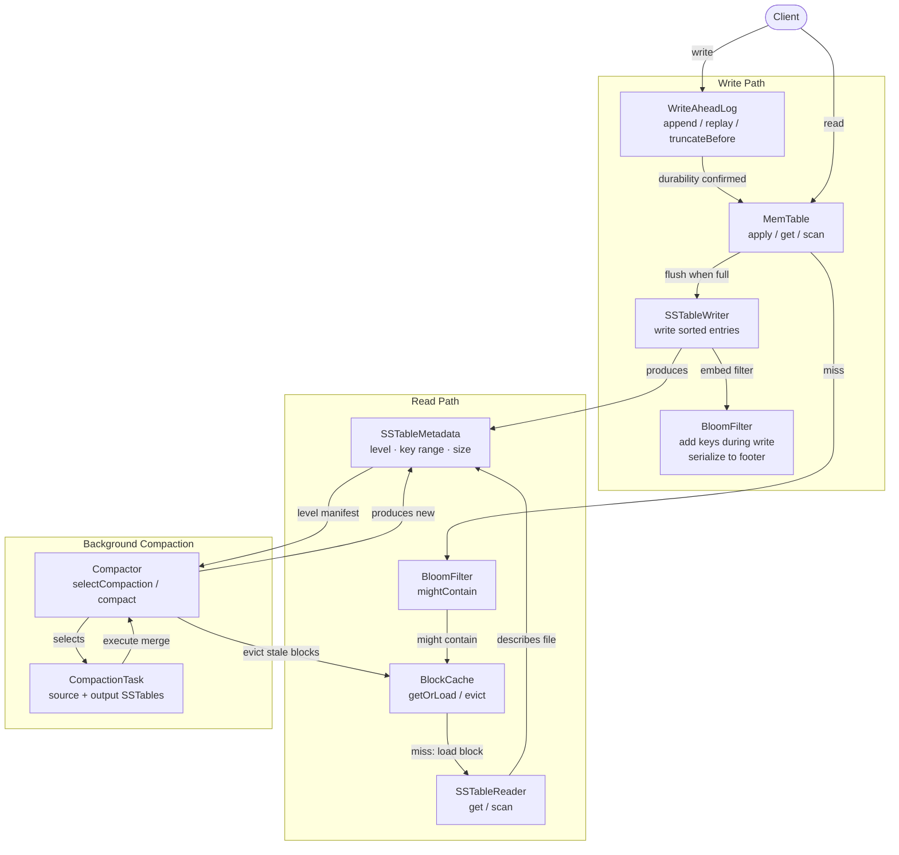

# jlsm

A pure Java 25 modular library of LSM-Tree (Log-Structured Merge-Tree) components.

> **Built entirely by [Claude Code](https://claude.ai/claude-code).** Every line of code, test, and design decision in this repository was written by Anthropic's Claude Code CLI under human direction. The project serves as both a serious LSM-Tree library and an experiment in how far AI-assisted development can be pushed — exploring productivity gains from AI agents working in a complex, multi-module codebase with strict TDD, JPMS boundaries, and real architectural tradeoffs.

## About

`jlsm` is an exploration of what a modern LSM-Tree library looks like when built from scratch with current Java features. The goal is not just to replicate established designs, but to take a fresh look at each component — experimenting with new data structures, novel compaction strategies, and storage abstractions that work across local and remote file systems.

There are no external runtime dependencies. The library is a pure composition of Java standard library components. All key/value representations use `MemorySegment` (Java's Foreign Function & Memory API), keeping the door open for off-heap storage and direct integration with vector data without extra copies.

## Modules

```
jlsm-core           All LSM-Tree interfaces and implementations
  |
  +-- jlsm-indexing  Full-text inverted index with stemming and stop words
  +-- jlsm-vector   ANN vector indices (IvfFlat, HNSW) with SIMD acceleration
  +-- jlsm-table    Document model, schema, secondary indices, fluent query API
  |     |
  |     +-- jlsm-sql     SQL SELECT parser and translator (hand-written, no deps)
  |     +-- jlsm-engine  In-process database engine with multi-table management
  |
  +-- (tests/jlsm-remote-integration)  S3 integration tests via S3Mock
```

### jlsm-core

The central module. All interfaces and their implementations live here.

| Component | What it does |
|---|---|
| **MemTable** | In-memory write buffer backed by `ConcurrentSkipListMap` |
| **SSTable** | Immutable sorted files with trie-based block encoding and sparse index |
| **Write-Ahead Log** | Durable append-only log — memory-mapped segments (local) or one-file-per-record (remote/S3) |
| **Bloom Filters** | Simple and blocked (512-bit, MurmurHash3 double-hashing) variants |
| **Compaction** | Size-tiered, leveled, and SPOOKY strategies |
| **Block Cache** | LRU and striped (multi-threaded) cache for hot SSTable blocks |
| **Compression** | Block-level codec abstraction with Deflate implementation and streaming decompression |
| **Encryption** | Field-level encryption — AES-GCM, AES-SIV, Order-Preserving (OPE), and DCPE-SAP |
| **LSM Tree** | `StandardLsmTree` and typed wrappers (String, Long, MemorySegment keys) |

File I/O is built on `java.nio` with a `SeekableByteChannel` abstraction that supports both local filesystems and remote object stores (e.g., S3 via Java NIO FileSystem SPI). Off-heap memory is managed through `ArenaBufferPool` backed by `Arena.ofShared()`; the SSTable writer's block size can be derived from the pool's buffer size via `TrieSSTableWriter.Builder.pool(ArenaBufferPool)` so deployment profiles are configured once on the pool and inherited by writers.

### jlsm-table

Schema-driven document model with typed fields (STRING, LONG, DOUBLE, BYTES, FLOAT16, VECTOR), nested objects, and a fluent query API. Includes:

- **Secondary indices** — scalar field indices, full-text indices, vector indices
- **Range-based partitioning** — split tables across key ranges with per-partition co-located indices
- **Field-level encryption** — encrypt individual fields with OPE for range queries on ciphertext
- **SIMD-optimized serialization** — `DocumentSerializer` uses `jdk.incubator.vector` for byte-swap acceleration
- **JSON and YAML** — built-in parsing and writing, no external libraries

### jlsm-indexing

Full-text inverted index backed by an LSM tree. Includes tokenization, Porter stemming, and English stop word filtering.

### jlsm-vector

Approximate Nearest Neighbor search with two index implementations:

- **IvfFlat** — Inverted File with Flat quantization
- **HNSW** — Hierarchical Navigable Small World graph

Both use SIMD acceleration via `jdk.incubator.vector` (`FloatVector.SPECIES_PREFERRED`).

### jlsm-sql

Hand-written recursive descent SQL parser supporting SELECT, WHERE, ORDER BY, LIMIT, OFFSET, MATCH(), VECTOR_DISTANCE(), and bind parameters. Translates SQL queries into the jlsm-table predicate tree — no external parsing libraries.

### jlsm-engine

In-process database engine that manages multiple named tables from a self-organized root directory. Each table gets its own subdirectory with WAL, SSTable, and metadata files. Features:

- **Interface-based handle pattern** — `Engine` and `Table` interfaces supporting embedded and future remote modes
- **Handle lifecycle tracking** — per-source attribution, configurable limits, greedy-source-first eviction under pressure
- **Per-table metadata directories** — lazy catalog recovery, partial-creation cleanup, per-table failure isolation
- **Thread-safe** — concurrent table creation, data operations, and handle management

---

## Architecture

All interfaces and their implementations live in `jlsm-core`. Higher-level modules layer on top. Consumers compose the pieces they need — the library does not mandate a single configuration.



### Core component interfaces

| Interface | Package | Responsibility |
|---|---|---|
| `WriteAheadLog` | `jlsm.core.wal` | Append entries to durable storage; replay on recovery; truncate after flush |
| `MemTable` | `jlsm.core.memtable` | In-memory write buffer; point lookup and range scan; tracks approximate size |
| `SSTableWriter` | `jlsm.core.sstable` | Write sorted entries to an immutable SSTable file; embeds a `BloomFilter` in the footer |
| `SSTableReader` | `jlsm.core.sstable` | Read-only view of an SSTable; point lookup and range scan; uses `BlockCache` |
| `BloomFilter` | `jlsm.core.bloom` | Probabilistic key membership test; serialize/deserialize for SSTable embedding |
| `Compactor` | `jlsm.core.compaction` | Select compaction candidates from level manifest; execute sorted merge; return new metadata |
| `BlockCache` | `jlsm.core.cache` | Cache hot SSTable blocks by `(sstableId, blockOffset)`; evict on compaction |
| `CompressionCodec` | `jlsm.core.compression` | Block-level compress/decompress with streaming support |

### Design decisions

Architectural decisions are documented as ADRs in `.decisions/`. Key decisions include:

| Decision | Approach |
|---|---|
| Engine API surface | Interface-based handle pattern with tracked lifecycle and lease eviction |
| Table catalog persistence | Per-table metadata directories with lazy recovery |
| Encryption strategy | Field-level encryption with static capability matrix and 3-tier search |
| SSTable compression | Block-level Deflate with streaming decompression during scans |
| Block cache striping | Stafford variant 13 (splitmix64) hash for stripe assignment |
| Table partitioning | Range partitioning with per-partition co-located indices |
| Vector serialization | Flat encoding — contiguous `d * sizeof(T)` bytes, no per-vector metadata |

---

## Developer Setup

### Prerequisites

- **Java 25** JDK — the project uses Java 25 language features and APIs; earlier versions are not supported
- **Gradle** — a wrapper is included; no separate installation is needed

### Building

```bash
# Compile, test, and assemble all modules
./gradlew build

# Run all tests
./gradlew test

# Run all verification (tests + static checks)
./gradlew check

# Run tests for a specific submodule
./gradlew :modules:jlsm-core:test

# Run a single test class
./gradlew :modules:jlsm-core:test --tests "jlsm.core.memtable.SomeTest"

# Run a single test method
./gradlew :modules:jlsm-core:test --tests "jlsm.core.memtable.SomeTest.methodName"
```

### Project structure

```
modules/
  jlsm-core/         All interfaces + implementations
  jlsm-indexing/      Full-text inverted index
  jlsm-vector/        ANN vector indices (IvfFlat, HNSW)
  jlsm-table/         Document model, schema, indices, query API
  jlsm-sql/           SQL SELECT parser and translator
  jlsm-engine/        In-process database engine
tests/
  jlsm-remote-integration/   S3 integration tests
examples/
  sample-db/          Example application wiring components
benchmarks/
  jlsm-bloom-benchmarks/     Bloom filter JMH benchmarks
  jlsm-tree-benchmarks/      LSM tree JMH benchmarks
.decisions/           Architectural decision records (ADRs)
.kb/                  Knowledge base (research findings)
```

Every submodule is a JPMS module with its own `module-info.java`. Inter-module dependencies are kept explicit and minimal.

### Running benchmarks

```bash
# Run all benchmarks for a module
./gradlew :benchmarks:jlsm-tree-benchmarks:jmh

# Run a specific benchmark class
./gradlew :benchmarks:jlsm-tree-benchmarks:jmh -PjmhIncludes="MemTableBenchmark"
```

Benchmark output is written to `perf-output/<module>/` with JSON results, JFR recordings, and profiler stacks.

---

## Changelog

See [CHANGELOG.md](CHANGELOG.md) for a history of all changes.
